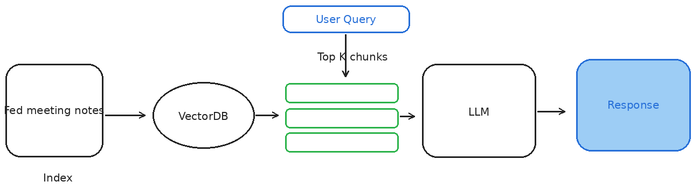
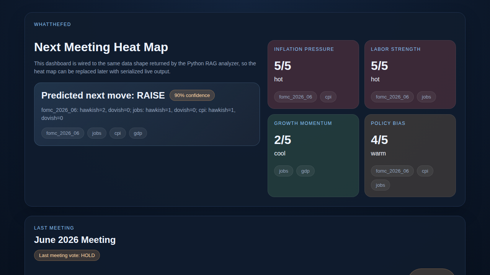

# WhatTheFed

Minimal retrieval-augmented analysis for FED meetings and trusted macro signals.

## What it does

- Ingests FED meeting notes and trusted signal documents
- Retrieves the most relevant evidence for a summary/prediction request
- Summarizes the latest meeting note
- Predicts the next FED move (`raise`, `hold`, or `cut`) from retrieved evidence
- Exposes dashboard-friendly data for a static HTML meeting page

## Architecture



## Quick usage

```python
from whatthefed.rag import Document, FedRAGAnalyzer

meeting_notes = [
    Document(
        source="fomc_2026_06",
        content="Committee kept rates unchanged while noting persistent inflation risks.",
        kind="meeting_note",
        meeting_date="2026-06-17",
    )
]

trusted_signals = [
    Document(source="cpi", content="Core CPI remains elevated and broad-based.", kind="trusted_signal"),
    Document(source="jobs", content="Labor market remains resilient with low unemployment.", kind="trusted_signal"),
]

analyzer = FedRAGAnalyzer()
report = analyzer.analyze(meeting_notes=meeting_notes, trusted_signals=trusted_signals)
print(report["last_meeting_summary"])
print(report["next_meeting_prediction"])
print(report["dashboard"]["next_meeting_heat_map"])
```

## Dashboard

Open `./index.html` in a browser to view a static dashboard prototype with:

- a next-meeting heat map
- a latest-meeting summary card
- 12 generic voter cards for the last meeting

The page is wired to the same top-level data shape returned by `FedRAGAnalyzer.analyze(...)`, so the inline demo payload can later be replaced with serialized RAG output.

